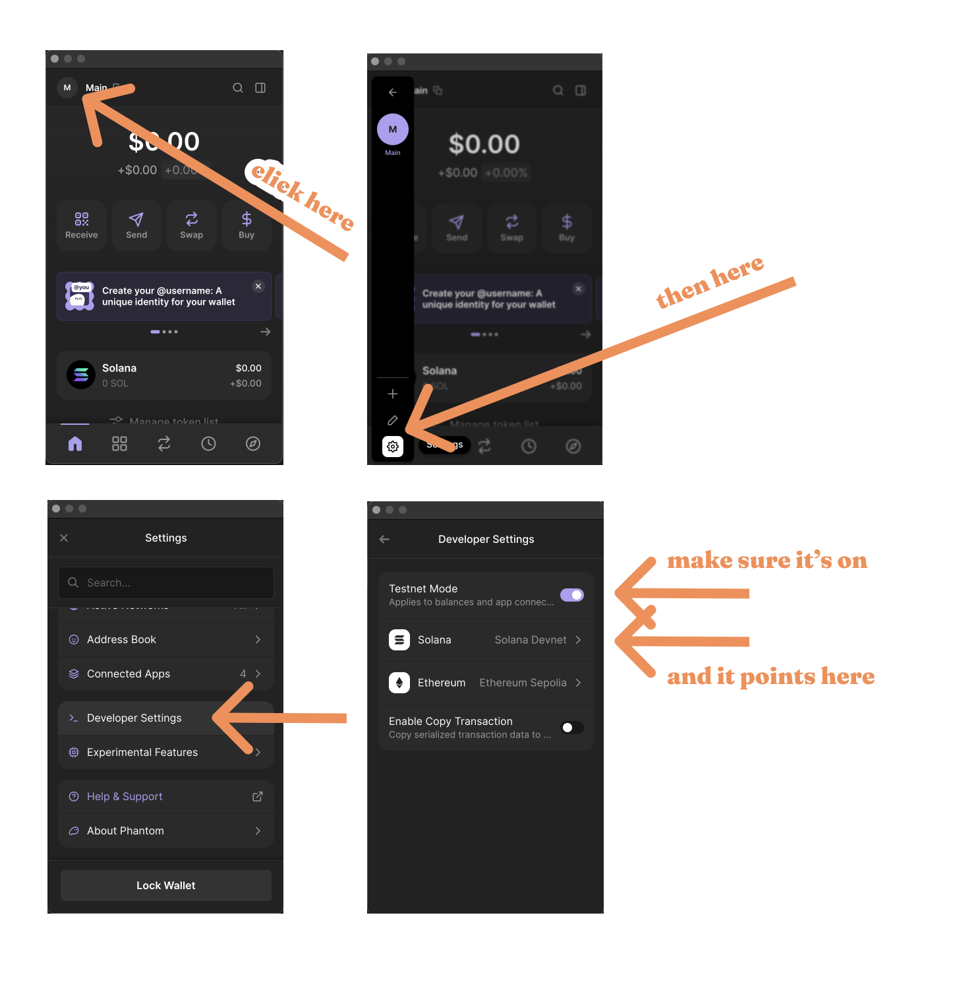

# 🥭 araza

**araza** is a protocol for exchanging value without borders.

It allows you to deposit USDC and get ĐĐ in return. It also allows you to securely swap ĐĐ tokens between users using a decentralized escrow.

## How it Works
  * Users deposit their USDC into the protocol.
  * The protocol mints ĐĐ tokens for the depositor.
  * Users can offer their ĐĐ tokens to other users.
  * The daemon matches the user's offer with the best available offer.
  * The daemon monitors c2c payments in the received bank statements and reconciles them with the user's ĐĐ offer pair.
  * The daemon safely releases the funds once the c2c payment is confirmed on both ends.

## How to use it

First, make sure you have the latest Phantom wallet installed. Other wallets are not supported yet.

  * https://www.phantom.app

Once you have the Phantom wallet installed, make sure it points to the Solana Devnet:

  * 

      
Make sure Phantom is pointing to Solana Devnet

      
    

Then, with Phantom facing devnet, get yourself some mock USDC:

  * https://spl-token-faucet.com/?token-name=USDC-Dev

After you have some mock USDC, you can deposit it into the protocol. Go here:

  * https://araza.xyz

And follow the instructions on the page to deposit your USDC,
or to redeem your ĐĐ back for USDC.

## Coming Soon

So far the three-legged escrow is not yet available in the web interface,
even though it's implemented in the protocol.

Stay tuned for updates.

## Naming

It's a [fruit](https://en.wikipedia.org/wiki/Eugenia_stipitata) serving as a reasonably unique token.
